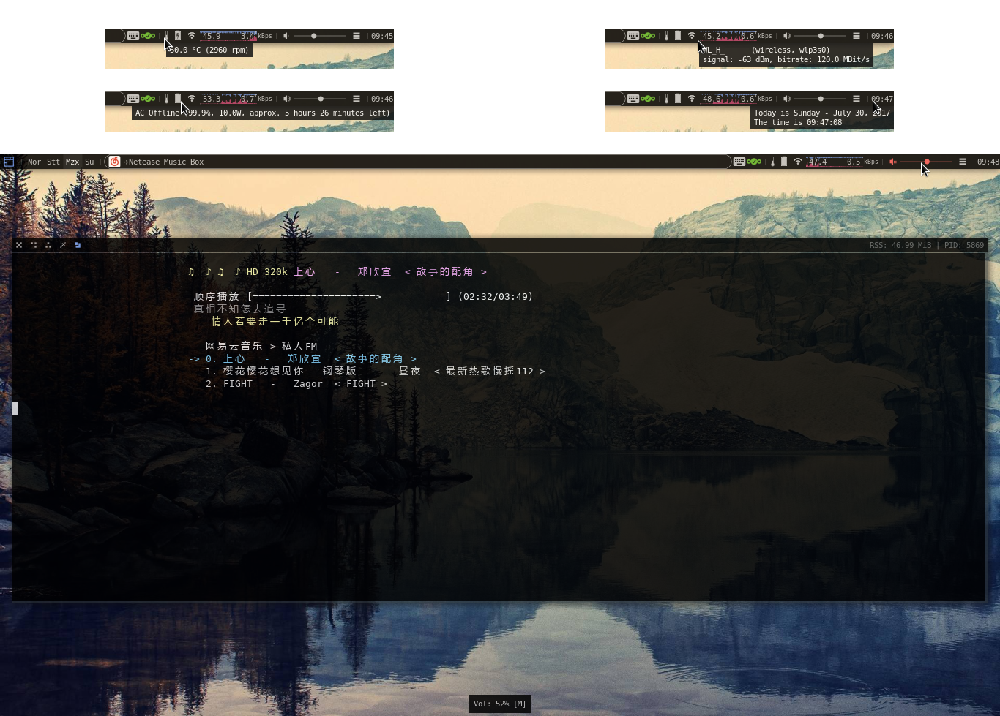

## X230 + Archlinux + AwesomeWM 配置文件

我的配置和主题文件，目的是避免以后万一系统需要重装麻烦

* 60G SSD 单 BtrFS 格式分区 + LUKS 全盘加密
* 自写 AwesomeWM 4.1 主题（网络显示依赖 NetworkManager, 声音调节依赖 pulseaudio 且不支持蓝牙），截图在最后

  * 文件 `/usr/share/awesome/lib/awful/widget/button.lua` 下有一个修改

```diff
@@ -40,7 +40,7 @@
         img_release = surface.load(image)
           img_press = img_release:create_similar(cairo.Content.COLOR_ALPHA, img_release.width, img_release.height)
                    local cr = cairo.Context(img_press)
---        cr:set_source_surface(img_release, 2, 2)
+++        cr:set_source_surface(img_release, 0, 0.5)
           cr:paint()
                    orig_set_image(self, img_release)
       end
```

* 无 display manager, tty 下通过 shell 判断是否 startx. 锁屏使用的 i3lock, 使用了 xautolock 来定时锁屏/休眠，但有一个问题是其无法判断当前是否正在播放视频，如果看视频的时候那就直接 `xautolock -disable` 来临时禁用就好
* Xterm 作为主 terminal, 透明已经在 awesome 下配置，需要启动 xcompmgr 以实现
* zsh 作为默认 shell
* tlp 来管理电源（需要 mask 掉 systemd-rfkill.service 和 systemd-rfkill.socket）
* fcitx 下自定义了一个未激活时的 icon，默认可以 `cp _mis/fcitx_inactive.png /usr/share/fcitx/skin/classic/inactive.png`
* musicbox 利用 Sakura 运行并自定义了图标， `cp _mic/netease-cloud-music.svg /usr/share/pixmaps/` ，自定义了颜色，直接修改 `ui.py` 大约 68 行：

```
            #info
            curses.init_pair(1, 231, curses.COLOR_BLACK)
            #hover
            curses.init_pair(2, 117, curses.COLOR_BLACK)
            #LRC
            curses.init_pair(3, 229, curses.COLOR_BLACK)
            #title
            curses.init_pair(4, 219, curses.COLOR_BLACK)
```

也可能有配置遗漏...





